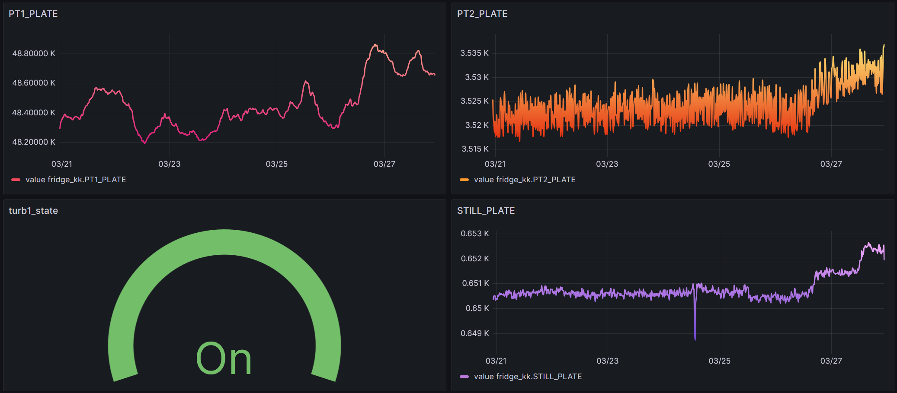

# Instrument Monitoring

The following is a guide to set up instrument montioring for various parameters associated with instrument(s). It contains capabilities for data storage, data visualization, and real-time alerts. More information on the tool is provided in the next section.

!!! Note
    The following guide assumes the user has:
    - instrumentserver installed and has basic familiarity with it and using config files
    - labcore installed
    - basic familiarity with Docker
    - a basic understanding of what Grafana and InfluxDB are

## Overview

This tool is designed to be able to facilitate the monitoring of instruments. It consists of multiple parts that must be set up:


[Docker](#docker)

Docker is the service used to host Grafana and InfluxDB locally. Both services have a server that runs inside of a Docker container on your internet-connected device, and will be accessible through the network the computer is connected to. Both Influx and Grafana will be accessible with an internet connection to the computer running Docker.

[Grafana](#grafana)

Grafana is the service used to visualize the data gathered from your instrument(s) of choice. It has functionality to both have visualization through dashboards, and also alerting capabilities through Slack integration and more. Below is an example of what a Grafana dashboard may look like.

Grafana is hosted locally on a internet-connected device, and can then be viewed while connected to the network and logging in to your Grafana account. It will live in a Docker container. (More on that later)



Below is a sample alert send out by Grafana on Slack. The alert notifies that a parameter (in this case MC) has passed a threshold. This is for a dilution refrigerator, and the parameter in this case is a value from a temperature sensor. This one, MC, is in the mixing chamber.


[InfluxDB](#influxdb)

InfluxDB is the database used to store data fetched from instruments. It stores the data in time-series format (data with a time). It can then be accessed by Grafana in order to construct time-series plots of the various parameters in the database (as shown above).

InfluxDB should be hosted on the same device as Grafana. It will also be in a Docker container. (again, more on that later)

[The Instrumentserver](#the-instrumentserver)

The instrumentserver is ran on a computer that can talk with your instrument through a network connection. The instrumentserver will ask your instrument for the data you specify, which will then be sent back to the instrumentserver by the instrument.

Based on a yaml file, the instrumentserver can then ask for the correct data from the instrument and broadcast it to the internet (to be used for visualizations).

How to set up the instrumentserver to get the data you want:
In the instrumentserver, for each instrument, the user provides a list of parameters to get values or states from, and a secondary field - polling rates. The polling rate for each parameter is how often the instrument server will ask for the value or state of the paramter.

[The Listener](#the-listener)

The listener is ran on the same computer that is running the Docker containers for Grafana and InfluxDB. It listens for the internet broadcasts from the instrumentserver, and then writes the data to the InfluxDB database. The listener can also be configured to write to a CSV file, however InfluxDB is recommended.

!!! Note
    The following portion assumes the user has:
    - instrumentserver installed and has basic familiarity with it and using config files
    - labcore installed

## The Instrumentserver

In order to use the dashboard, we will need to have an instance of the instrumentserver running to fetch data from the fridge computer. 

### Config File

Below is an example instrumentserver configuration file that can be used for the dashboard.


```yaml
instruments:
  
  fridge_nh:
    type: labcore.instruments.qcodes_drivers.Oxford.triton.OxfordTriton
    address: 192.168.1.1
    init: 
      port: 33576
      temp_channel_mapping:
          T1: "PT2_HEAD"
          T2: "PT2_PLATE"
          T3: "STILL_PLATE"
          T4: "COLD_PLATE"
          T6: "PT1_HEAD"
          T7: "PT1_PLATE"
          T8: "MC_PLATE_RUO2"

    pollingRate:
      comp_state: 15
      PT1_PLATE: 15
      PT2_PLATE: 15
      STILL_PLATE: 15
      COLD_PLATE: 15
      MC_PLATE_RUO2: 15
      turb1_state: 15
      turb1_speed: 15

networking:
  externalBroadcast: "tcp://128.174.123.123:6000"
```


As usual, we declare an instrument for the fridge. For the driver, use the following from labcore if using an Oxford Fridge:

```
labcore.instruments.qcodes_drivers.Oxford.triton.OxfordTriton
```

`address`: fill out the field with the IPv4 address of the fridge computer (on the same network as the computer you are running the instrumentserver on)

`init`: there are two items that must be filled out:

`port`: From the manual of the fridge being used, provide the port on the fridge computer to communicate with. (For Oxford Triton, this port is `33576`). 

`temp_channel_mapping`: Create a dictionary containing the mapping between name and temperature channel for each channel you would like a named parameter for. In the provided config, 7 Temperature Channels are used to create named parameters. Channels can be found on the Lakeshore thermometry dialog on the fridge computer.

`pollingRate`: provide a dictionary for how often to poll each parameter given. For each parameter that you wish to fetch data for, add it as a new line in the dictionary, followed by the interval (in seconds) to fetch it.

`networking`: For the dashboard, only one field is required, `externalBroadcast`. Locate the IPv4 address of the computer you are running the instrumentserver on for the internet network you wish to broadcast the data to. Include the port to broadcast to as well.


### Starting the Instrument Server


Use the following to start the instrumentserver. Replace serverConfig.yml with the path to the config file you created above.

```bash
$ instrumentserver -c serverConfig.yml --gui False
```

You should start the instrumentserver using the above commmand in no GUI mode first. Then, you can use the following detached mode if you wish to use the GUI:

```bash
$ instrumentserver-detached
```

!!! Note
    The following portion assumes the user has:
    - instrumentserver installed

## The Listener

To use the dashboard, we will also need to run an instance of the listener on whichever computer you wish to host the dashboard on. (The computer with the listener and the computer with the instrumentserver must be on the same network). The listener can be used for writing data either in a CSV file or the InfluxDB database.

### Config File

Below is an example listener configuration file that can be used for the dashboard.

```yaml

# addresses to listen for broadcasts at
addresses: ["tcp://128.174.123.123:6000","tcp://128.174.456.456:6000","tcp://128.174.789.789:6000"]

# list of parameters to listen for, if empty, will listen for all broadcasts
paramDict: {"fridge_nh":[],"fridge_dt":[],"fridge_kk":[]}

# path to write data to for the CSV listener
csv_path: C:\Users\jmnol\OneDrive\Documents\InstrumentServerData\data.csv

# type of listener (where the listener writes data to)
type: "Influx"

# InfluxDB token for Influx listener
token: "token"

# InfluxDB org for Influx listener
org: "pfafflab"

# InfluxDB buckets for Influx listener, in the same order as addresses
bucketDict: {"fridge_nh":"niflheim","fridge_kk":"kelvin_klein","fridge_dt":"demeter"}

# InfluxDB url for Influx listener
url: "http://localhost:8086"

# measurement Name for Influx listener
measurementNameDict: {"fridge_nh":"niflheim_telemetry","fridge_kk":"kelvin_klein_telemetry","fridge_dt":"demeter_telemetry"}
```

#### Necessary Parameters for using InfluxDB

`addresses`: List of addresses of where to subscribe to broadcasts from. These are the addresses on the network of the computer running the instrumentserver

`paramDict`: Dictionary containing the list of parameters to listen for for each instrument. If the list for an instrument is empty, the listener will listen for all broadcasts from that instrument.

`type`: "Influx" or "CSV"

`token`: Token to write to InfluxDB. (Created when setting up Influx)

`org`: Organization to write to InfluxDB. (Created when setting up Influx)

`bucketDict`: Dictionary containing the mapping for each instrument to a bucket in Influx

`url`: URL to where the Influx database is hosted on the computer running the listener

`measurementNameDict`: Name of the measurement (one of the fields for a data point) that will be applied to the data from an instrument

#### Necessary Parameters for using CSV

`addresses`: List of addresses of where to subscribe to broadcasts from. These are the addresses on the network of the computer running the instrumentserver

`paramDict`: Dictionary containing the list of parameters to listen for for each instrument. If the list for an instrument is empty, the listener will listen for all broadcasts from that instrument.

`csv_path`: Path of the csv file to write data to. A CSV file doesn't need to exist at the path as the listener will create one if one does not exist.

`type`: "Influx" or "CSV"

### Starting the Listener

Use the following to start the instrumentserver. Replace listenerConfig.yml with the path to the config file you created above.

```bash
$ instrumentserver-listener -c listenerConfig.yml
```

One may choose to use the following command to not display output and instead have it written to a file:

```bash
$ nohup instrumentserver-listener -c listenerConfig.yml
```

The process can be killed with:

```bash
$ ps aux | grep instrumentserver-listener
```

You can then find the ID number of the process and kill it with:

```bash
$ kill -15 {INSERT ID}
```

!!! Note
    The following portion assumes the user has:
    - Docker Engine installed
    - Basic familiarity with Docker

## Docker

Docker is the service that will be used to host both Influx and Grafana.

```yaml
services:

  grafana:

    image: grafana
    container_name: grafana
    restart: unless-stopped

    ports:
     - '1000:1000'

    volumes:
      - grafana-storage:/var/lib/grafana
      - ./data:/etc/grafana/data

    entrypoint: ["/bin/sh", "-c", "export GF_SECURITY_ADMIN_USER=$(cat /run/secrets/.env.grafana-username) && /run.sh"]
    entrypoint: ["/bin/sh", "-c", "export GF_SECURITY_ADMIN_PASSWORD=$(cat /run/secrets/.env.grafana-password) && /run.sh"]

    secrets:
      - grafana-username
      - grafana-password

  influxdb2:

    image: influxdb:2

    ports:
      - 8080:8080

    environment:
      DOCKER_INFLUXDB_INIT_MODE: setup
      DOCKER_INFLUXDB_INIT_USERNAME_FILE: /run/secrets/influxdb2-admin-username
      DOCKER_INFLUXDB_INIT_PASSWORD_FILE: /run/secrets/influxdb2-admin-password
      DOCKER_INFLUXDB_INIT_ADMIN_TOKEN_FILE: /run/secrets/influxdb2-admin-token
      DOCKER_INFLUXDB_INIT_ORG: org
      DOCKER_INFLUXDB_INIT_BUCKET: bucket1

    secrets:
      - influxdb2-admin-username
      - influxdb2-admin-password
      - influxdb2-admin-token

    volumes:
      - type: volume
        source: influxdb2-data
        target: /var/lib/influxdb2
      - type: volume
        source: influxdb2-config
        target: /etc/influxdb2

volumes:
  grafana-storage: {}
  influxdb2-data:
  influxdb2-config:

secrets:
  grafana-username:
    file: .env.grafana-username
  grafana-password:
    file: .env.grafana-password
  influxdb2-admin-username:
    file: .env.influxdb2-admin-username
  influxdb2-admin-password:
    file: .env.influxdb2-admin-password
  influxdb2-admin-token:
    file: .env.influxdb2-admin-token
```

Above is a sample Docker Compose file. This is what is used to start the instances of Grafana and InfluxDB. Most of it should not be modified.

To use the above file, provide 5 files:
```
 .env.grafana-username
 .env.grafana-password
 .env.influxdb2-admin-username
 .env.influxdb2-admin-password
 .env.influxdb2-admin-token
```
These will be the respective usernames and passwords for each service, and then a token for the database, which is used by the entity writing to the database. These files should be in the same directory as the docker compose file.

If you wish to add more plugins, modify a few things:

1. Modify the Dockerfile. On the line including, "GF_INSTALL_PLUGINS", include your wanted plugins in a comma-separated list.

2. Run the following command:
```bash
$ sudo docker build -t (insert-image-name) .
```
Replace (insert-image-name) with your desired name and directory location.

3. Modify the docker compose file:
Under the grafana section, under "image", replace the default image "grafana" with your newly created image.

Now that your Docker compose is fully set up, you can start both services with the following command (run in the directory of the docker compose file)
```bash
$ sudo docker compose up -d
```

You can then close both with the following:
```bash
$ sudo docker compose down
```
!!! Note
    Closing will take ~ 10 seconds

## InfluxDB

Now that you have the instances of Grafana and Influx working, there is a bit more setup necessary to put it all together.

First, you must create a bucket where you wish to store your data.

Now, you should have all of the necessary information to fill out the config file for the listener (section is above). As long as everything is set up correctly, if the listener is running and receiving data, it should be writing the data it receives to Influx.

## Grafana

Now that you have an Influx database being populated by your data, you are ready to set up a dashboard. To create a dashboard, please follow the documentation for grafana https://grafana.com/docs/grafana/latest/dashboards/.

To use the data from Influx, you must add it as a source: https://grafana.com/docs/grafana/latest/datasources/

Then, within each panel of the dashboard, you must write a query to get the correct data from the database.

Here is an example query that may be helpful (or a good starting point):
```
from(bucket: "bucket1")
  |> range(start: v.timeRangeStart, stop: v.timeRangeStop)
  |> filter(fn: (r) => r["_measurement"] == "measurement1")
  |> filter(fn: (r) => r["_field"] == "value")
  |> filter(fn: (r) => r["name"] == "bucket1.param1" or r["name"] == "bucket1.param2")
  |> aggregateWindow(every: v.windowPeriod, fn: mean, createEmpty: false)
  |> yield(name: "mean")
```
The above query will display parameters in bucket1 with fields "measurement" being "measurement1", "field" being "value", and name being "param1" or "param2".

When creating your panel, select "Time Series" in Grafana.